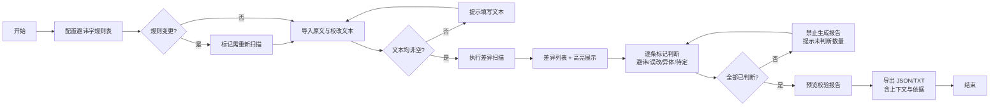

## 1. 产品概述

古籍文本避讳校验系统是面向古籍研究人员的专业工具，用于自动化检测和人工复核古籍中因避讳制度产生的文字改动（避帝讳、避家讳等），以及误改、异体字替换等情况。系统通过差异比对算法自动识别原文与校改文本的文字出入，结合可配置的避讳字规则表进行智能匹配，最终生成可导出的校验报告。

- 目标用户：古籍文献研究员、校勘学工作者、数字人文研究者
- 核心价值：将传统人工校勘流程数字化，提升避讳字检出效率与判断可追溯性

## 2. 核心功能

### 2.1 用户角色
| 角色 | 注册方式 | 核心权限 |
|------|----------|----------|
| 研究人员 | 无需注册，本地使用 | 全部功能：配置规则、导入文本、标记差异、生成报告 |

### 2.2 功能模块
1. **规则管理页**：避讳字规则表增删改查、去重校验、批量导入、启用/禁用
2. **文本导入与差异扫描页**：原始文本/校改文本粘贴或文件导入、差异自动扫描与高亮
3. **差异审核与标记页**：逐条差异并排展示、上下文呈现、四态判断（避讳/误改/异体/待定）、备注输入
4. **校验报告页**：统计概览、未判断提醒、筛选过滤、报告预览、多格式导出（JSON/TXT）

### 2.3 页面详情
| 页面名称 | 模块名称 | 功能描述 |
|-----------|-------------|---------------------|
| 规则管理页 | 规则列表 | 表格展示避讳字（原字、替换字、朝代/出处、备注、启用状态） |
| 规则管理页 | 新增/编辑规则 | 表单弹窗，原字+替换字联合去重校验 |
| 规则管理页 | 规则变更提示 | 修改规则后弹出"需重新扫描差异"提示 |
| 文本导入页 | 文本输入区 | 左右双栏文本框，支持粘贴与 .txt 文件上传 |
| 文本导入页 | 扫描触发 | 校验非空后启动扫描，展示差异数量统计 |
| 差异审核页 | 差异高亮对比 | 左右文本同步高亮差异位置，色带区分新增/删除/替换 |
| 差异审核页 | 差异条目列表 | 列表含序号、原文片段、校改片段、匹配规则、判断状态、操作按钮 |
| 差异审核页 | 判断操作面板 | 四选一单选按钮组 + 备注文本框 + 保存判断按钮 |
| 校验报告页 | 统计卡片 | 总差异数、已判断数、各类判断占比 |
| 校验报告页 | 报告导出 | 生成 JSON（结构化）与 TXT（可读），含上下文与判断依据 |

## 3. 核心流程

用户进入系统后首先配置或确认避讳字规则表 → 导入原始文本与校改文本（系统校验非空）→ 触发差异扫描，系统逐字比对并匹配规则 → 进入差异审核，逐条标记判断类型与备注 → 修改规则后系统提示需重新扫描（清空现有判断）→ 所有差异判断完成后，进入报告页预览与导出。

## 4. 用户界面设计

### 4.1 设计风格
- 主色调：米白宣纸色 `#F5F0E6` 为底，搭配古籍朱红 `#8B2500` 与墨黑 `#1C1C1C`
- 辅助色：差异高亮采用藤黄 `#E8C84A`（疑似避讳）、石青 `#2E5E8A`（异体）、胭脂红 `#B8336A`（误改）、灰绿 `#7A8B6E`（待定）
- 按钮样式：圆角 4px，宋体字标，主按钮为朱红底米白字，配细线边框
- 字体：正文采用"思源宋体/Noto Serif SC"，标题采用"方正宋刻本秀楷"风格衬线字体，数字与代码区采用等宽字体
- 布局风格：顶部窄导航 + 主体三栏（左侧导航、中间主区、右侧详情面板），卡片式内容容器，1px 深色细线分割
- 图标风格：线性简约图标（Lucide），搭配古籍纹样分隔线装饰

### 4.2 页面设计概述
| 页面名称 | 模块名称 | UI 元素 |
|-----------|-------------|----------|
| 规则管理页 | 规则列表 | 仿古线装书风格表格，斑马纹浅米色交替，行悬停朱红描边 |
| 文本导入页 | 双栏输入区 | 宣纸纹理背景 textarea，卷边装饰，字数统计徽标 |
| 差异审核页 | 对比视图 | 左右卷轴式容器，差异处彩色底纹 + 侧边色带定位条 |
| 差异审核页 | 判断面板 | 四种颜色对应四种判断的卡片式单选，选中时边框加粗并显示勾选标记 |
| 校验报告页 | 统计卡片 | 仿古籍函套设计，数字大号宋体显示，配朱红印章式徽标 |

### 4.3 响应式
桌面端优先（≥1280px），三栏布局；平板端（768-1279px）折叠为两栏，详情面板改为底部抽屉；移动端（<768px）单栏顺序排列，差异列表与判断面板上下叠放，文本对比采用上下分栏而非左右。触屏优化：判断按钮加大热区至 44x44px。

### 4.4 装饰细节
- 页面四角使用简化的古籍版框装饰线
- 节标题处配「卷一」「卷二」式编号
- 导出报告使用仿雕版字体水印背景
