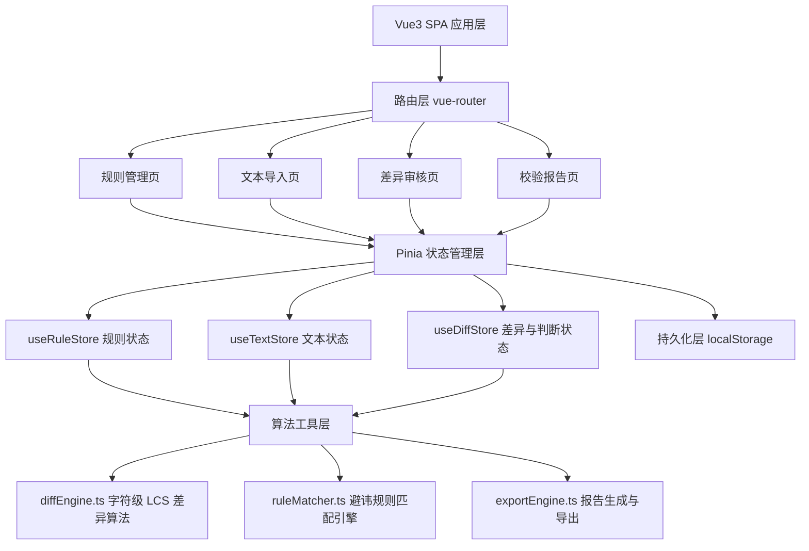
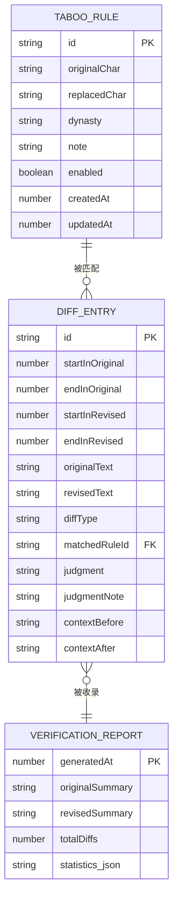

## 1. 架构设计

本系统为纯前端单页应用，所有数据存储于浏览器内存与 localStorage，无需后端服务。业务层采用 Vue Composition API 配合 Pinia 状态管理，算法层独立封装差异比对与规则匹配工具函数，视图层由多个职责清晰的页面组件与子组件构成。



## 2. 技术描述

- 前端框架：Vue@3.5 + `<script setup lang="ts">` Composition API
- 构建工具：Vite@5 + TypeScript@5.4
- 状态管理：Pinia@2
- 路由：Vue Router@4（Hash 模式，便于静态部署）
- 样式体系：TailwindCSS@3 + 自定义 CSS 变量（古籍主题色）
- 图标库：lucide-vue-next
- 文件处理：原生 FileReader API（读取 .txt）+ Blob/URL.createObjectURL（导出）
- 数据持久化：localStorage（键名前缀 `ancientscrutiny_`）
- 后端：无
- 数据库：无（mock 数据通过 localStorage 初始化）

## 3. 路由定义

| 路由路径 | 页面组件 | 用途 |
|----------|----------|------|
| `/` | Redirect → `/rules` | 根路径重定向至规则管理 |
| `/rules` | RuleManager.vue | 避讳字规则表管理 |
| `/import` | TextImport.vue | 原文与校改文本导入及扫描触发 |
| `/review` | DiffReview.vue | 差异列表、高亮对比、判断标记 |
| `/report` | ReportPage.vue | 统计概览、报告预览与导出 |

导航守卫：`/review` 与 `/report` 路由需检查文本与差异数据是否存在，不存在则重定向至 `/import` 并提示。

## 4. API 定义（无后端，模块接口定义）

### 4.1 核心类型模块 `src/types/index.ts`

```typescript
// 避讳字规则
export interface TabooRule {
  id: string;
  originalChar: string;    // 原字（需避讳之字）
  replacedChar: string;    // 替换字/缺笔字/异体字
  dynasty?: string;        // 朝代/出处
  note?: string;           // 备注说明
  enabled: boolean;        // 是否启用
  createdAt: number;
  updatedAt: number;
}

// 判断类型
export type JudgmentType = 'taboo' | 'error' | 'variant' | 'pending' | null;

// 单个差异条目
export interface DiffEntry {
  id: string;
  startInOriginal: number;   // 原文起始偏移
  endInOriginal: number;     // 原文结束偏移
  startInRevised: number;    // 校改文起始偏移
  endInRevised: number;      // 校改文结束偏移
  originalText: string;      // 原文片段
  revisedText: string;       // 校改文片段
  diffType: 'replace' | 'insert' | 'delete';
  matchedRuleId?: string;    // 匹配到的避讳规则（可空）
  matchedRule?: TabooRule;   // 规则快照
  judgment: JudgmentType;    // 判断结果
  judgmentNote?: string;     // 判断依据/备注
  contextBefore: string;     // 差异前上下文（10字）
  contextAfter: string;      // 差异后上下文（10字）
}

// 扫描状态
export type ScanStatus = 'idle' | 'scanning' | 'done' | 'stale';

// 校验报告
export interface VerificationReport {
  generatedAt: number;
  originalSummary: string;   // 原文摘要（前30字）
  revisedSummary: string;    // 校改文摘要
  totalDiffs: number;
  statistics: {
    taboo: number;
    error: number;
    variant: number;
    pending: number;
  };
  judgments: DiffEntry[];
}
```

### 4.2 核心方法模块接口

```typescript
// diffEngine.ts
export function computeCharDiff(original: string, revised: string): DiffEntry[];
// ruleMatcher.ts
export function matchRulesToDiffs(diffs: DiffEntry[], rules: TabooRule[]): DiffEntry[];
// exportEngine.ts
export function generateReportJSON(report: VerificationReport): string;
export function generateReportTXT(report: VerificationReport): string;
export function downloadFile(content: string, filename: string, mimeType: string): void;
```

## 5. 服务器架构图（无后端）

本项目为纯前端应用，不涉及服务器分层。所有逻辑在客户端执行，数据流为「用户交互 → Pinia Store → 算法工具 → Store 更新 → 视图响应」。

## 6. 数据模型

### 6.1 数据模型关系



### 6.2 初始 Mock 数据（localStorage 种子）

系统首次启动时若无数据，自动注入以下避讳字规则示例：

| originalChar | replacedChar | dynasty | note | enabled |
|---|---|---|---|---|
| 玄 | 元 | 清代（避康熙讳） | 玄烨之「玄」改作「元」或缺末笔 | true |
| 弘 | 宏 | 清代（避乾隆讳） | 弘历之「弘」改作「宏」 | true |
| 曆 | 歷 | 清代（避乾隆讳） | 「曆」改为「歷」 | true |
| 丘 | 邱 | 清代（避孔子讳） | 丘姓加邑作邱 | true |
| 胤 | 允 | 宋代（避宋太祖讳） | 匡胤之「胤」改作「允」 | true |
| 鏡 | 鑑 | 宋代（避宋太祖讳） | 赵敬之「敬」嫌名改「鑑」 | true |
| 民 | 人 | 唐代（避唐太宗讳） | 李世民之「民」改作「人」 | true |
| 世 | 代 | 唐代（避唐太宗讳） | 「世」改作「代」或字缺笔 | true |

以及两段示例文本（《道德经》片段）：原文含 8 处上述字，校改文对其中 5 处做替换，2 处为异体字，1 处为明显误改，用于功能演示。

### 6.3 业务约束实现位置

| 约束 | 实现位置 | 方式 |
|---|---|---|
| 避讳字不重复（原字+替换字联合唯一） | useRuleStore.addRule / updateRule | 新增前 `rules.find` 检查；视图层表单实时校验 |
| 原文和校改文本不能为空 | TextImport.vue 扫描按钮事件 | 前端空值校验 + 红色提示框 |
| 同一差异位置只有一个最终判断 | DiffReview.vue 判断面板单选按钮 | radio 互斥 + 模型单一值 `judgment` |
| 未判断差异不能生成报告 | ReportPage.vue 导出按钮 + Pinia getter | `allJudged` getter 控制按钮 disabled + 计数提示 |
| 修改规则后差异需重新扫描 | useRuleStore.$subscribe 监听变更 | 置 `scanStatus = 'stale'` 并清空 `diffEntries`，全局提示条 |
| 导出保留上下文与判断依据 | exportEngine.ts 序列化逻辑 | JSON 全字段输出；TXT 每条差异包含「上下文、原文、校改、判断、依据、匹配规则」 |
